# [Channel Pruning for Accelerating Very Deep Neural Networks](https://arxiv.org/pdf/1707.06168.pdf)

[Yihui He](), [Xiangyu Zhang](), [Jian Sun]()

## Basic Idea
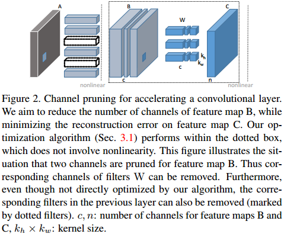 
* 图中A, B, C是网络中3层连续的feature map, 删除B到C的权值W的一些channel(如图中c), 得到一个新的feature map C', 重训练相关参数使新的C'和原始的C尽可能接近(向量距离最小) 
* 此时由于W中第c个channel被删除, 则输入feature map中第c个channel也没必要计算, 故而A到B过程中对应的filter也可以被删除 
* 有点像是使用矩阵分解来压缩网络的方法，都是使用小矩阵来维持原来网络的输出

**不同于现有很多根据一些Functionality定义一个Importance, 然后基于贪心去剪枝重训练的方法(Functionality可能无法保证), 这种方法从数学上用尽量少的参数来维持原来Layer的Functionality.**

## Details
对于每一层的剪枝可以分为两个阶段
1. 从所有的filter中筛选一些most representative channels(LASSO回归)
2. 使用剩余的channel来得到新的输出C', 并使C'与原始网络输出C之间的误差最小(最小二乘)

### Problem Formulation
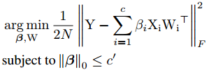 
* Y是网络原始的输出, 即上述的C. X是该层的输入, W是该层的输出
* i表示第i个channel, β是一个{0, 1}-mask. 用于表明对应的channel是否被保留
* **β**向量中1的数量应该<=c', 亦即此层最多只保留c'个channel. 而c'是一个人为设置的超参数

为了求解上述优化问题, rewrite上述公式: 
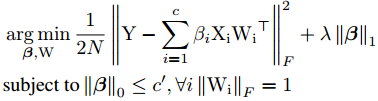 
* 增加了一个L-1正则化项, 可以通过改变λ来调节**β**的稀疏化程度
* 添加的关于W的约束是为了避免trivial solution??????

之后就是交替优化**β**和**W** 
1. 固定**W**优化**β** 
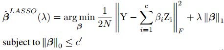 
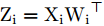 
2. 固定**β**优化**W** 
 
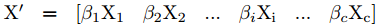 

由于交替计算训练会很慢, 论文中实际采用的是逐渐调大λ多次重复(1)直到**β**足够稀疏, 然后再执行一次(2)到收敛 
对于整个网络就是逐层的作这样的处理就可以

## 拓展到multi-branch网络
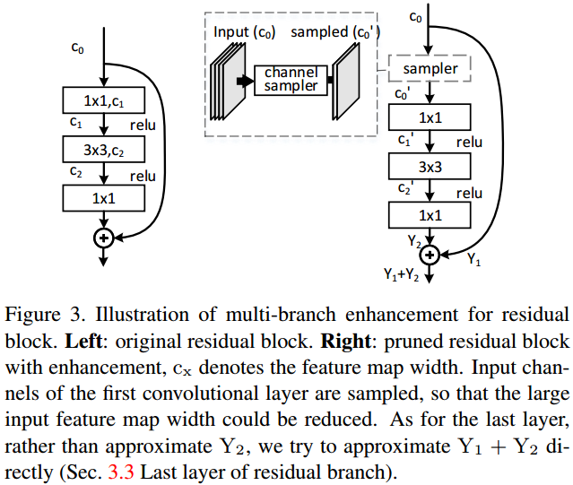
### The First Layer
* 如图中所示, 输入c_0会被用于1x1卷积以生成c_1以及用于残差相加.
* 根据这个1x1卷积weight的channel稀疏性在c_0中筛选出一个c_0'用于卷积计算, 原始的c_0用于残差相加

### The Last Layer
* 恢复的目的是要把Y_1'+Y_2'恢复到Y_1+Y_2, 所以其是把Y_2'恢复到Y_1+Y_2-Y_1'

## Experiments
单层的结果 
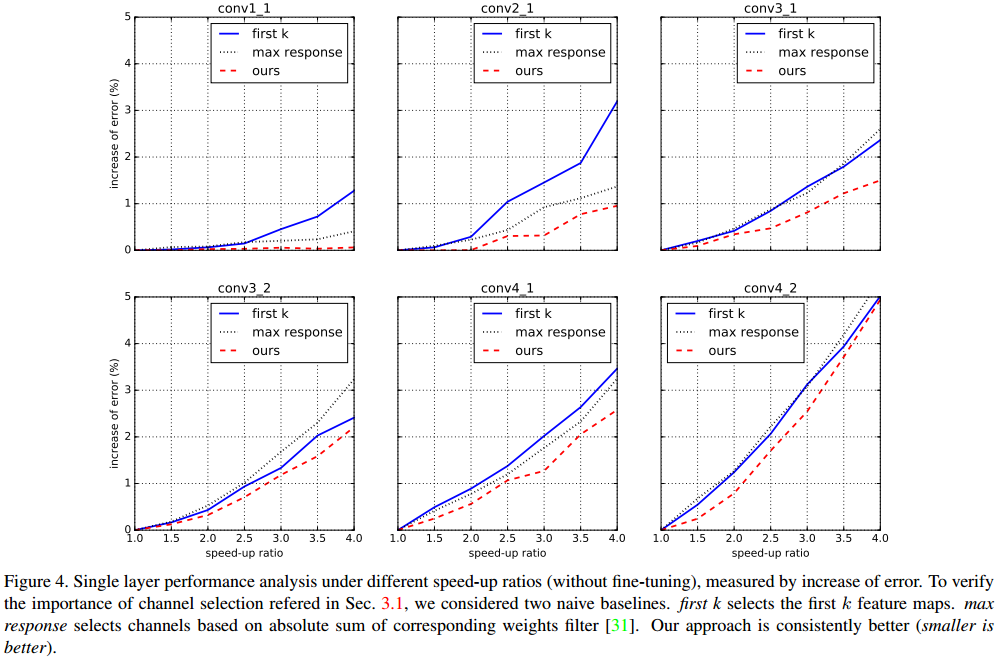 
VGG16的结果 
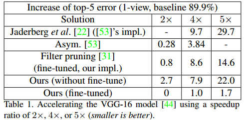 
与其他方法(spatial, channel factorization, and channel pruning)结合 
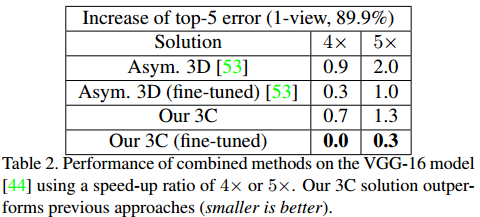 
用于物体检测网络 
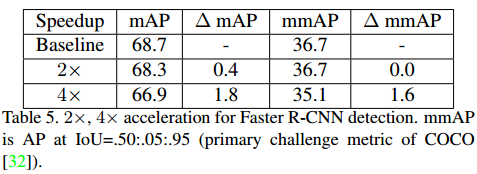 
ResNet上的结果 
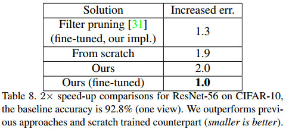 