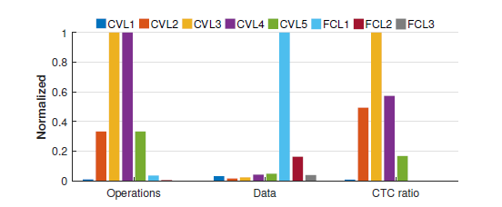
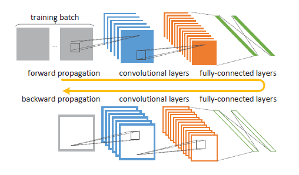
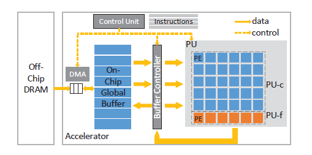
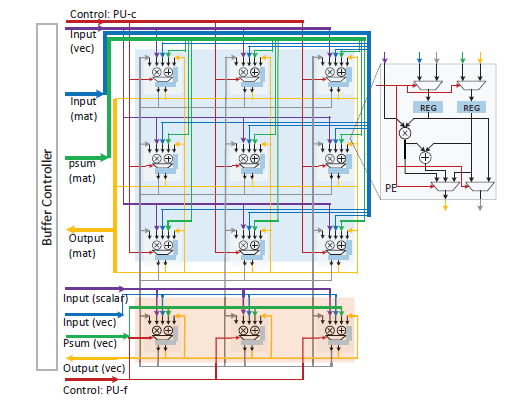
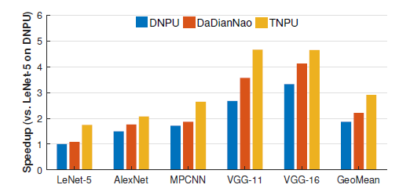
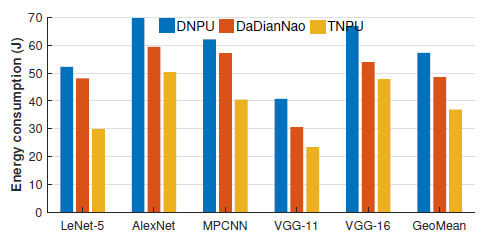
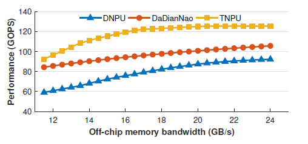

# TNPU: An Efficient Accelerator Architecture for Training Convolutional Neural Networks
> [文章链接](https://dl.acm.org/citation.cfm?id=3287641) 
## Introduction
  Training phase中存在大量的计算和存储访问任务，而现有的加速器大多数用于CNN的inference phase，由于training过程中在卷积层和全连接层中具有不同的资源需求以及双向的数据相关，因此现有accelerator无法满足需求。本文利用CVLs与FCLs间资源需求的互补效应，在同一块computing unit上为CVLs和FCLs设计模块同时提出一种简化的 out-of-order scheduling mechanism去解决双向数据相关的问题，使两层的计算实现并行化提高资源的利用效率。
## Motivation
### Resource Requirement Diversity
CTC(Computation to Communication) ratio = N(op)/N(d) 是用来衡量不同的资源需求，在一段时间内，N(op)代表总的计算操作，N(d)代表外部数据的访问量。CTC值较大即计算密集型，较小则是访存密集型。根据fig1
，  
可知：
* FCLs：需要大量的 Memory Access，对计算的需求相对较小。
* CVLs：需要进行大量的计算，访存需求较小。  

由于当前加速器大多只在计算能力上对卷积层进行加速，使得在用该加速器对FCLs操作时，会suffer high memory transaction costs，同时造成计算资源的浪费，使性能下降。However，FCLs中大量的访存现多通过Compression去解决，但只适用于inference phase。
### Bidirectional Data Dependency 
  
fig.2是训练CNN的backpropagation algorithms,从中我们将其分为四个阶段：
* forward propagation (FP)
* backward propagation(BP)
* gradient descent computation (GD)
* weight update(WU)       

在FP phase中，数据在CVLs中处理输出后再输入到FCLs中，这里存在数据相关；同时，在BP phase中，数据先经过FCLs的处理再输入到CVLs中，这里也存在数据相关，两者呈反向的关系。其他phase如GD、WU没有显式的数据相关。
## TNPU Architecture
### Architecture
  
fig3即加速器的架构图，包括 
* a control unit
* a buffer controller
* on-chip global buffer
* a direct memory access (DMA) module
* a processing unit (PU)
* off-chip DRAM     

PU模块由通过2D mesh Noc互连的PEs组成，分为PU-c和PU-f分别对CVL和FCL层进行计算，能够执行大量数据计算并行。存储在off-chip DRAM中的外部数据通过DMA module控制Cache到buffer中，buffer controller再根据control unit的指令将数据transfer到PU中的PEs进行数据处理。这些操作是基于control unit中的**loaded instructions**。
### Simplified OoO Scheduling Mechanism
由于存在数据相关，若要提高性能需进行有效的调度。首先，假设提供的带宽足够大，由于WU过程
1. 在training batch中只出现一次
2. 计算量远小于其他phases  

因此暂不做考虑。在FP、BP、GD phase中均存在CVL和FCL，因此用两级流水线展示这一过程，用（x-y-z）的方式表示事件，**x**代表training instance id，**y**表示phase type，**z**表示layer type，如fig4中(1)所示
  
其中黑色箭头表示**数据相关**。可以看出，只有T3阶段PU-c和PU-f同时在并行工作而T0、1、2、4只有一种类型的计算，资源利用率较低。由于**在batch中的training instance间不存在数据相关**，那么可以考虑在当前PU-c空闲的情况下插入下一个instance的CVL计算，使all time slot 中的PU-c和PU-f同时保持busy状态，如fig4中(2)所示，达到提升性能的目的。  
### PU and PEs
   
fig5是PU的内部架构，其中蓝色块为PU-c，红色块是PU-f，之间按2D mesh topology互连，PU-f之所以比PU-c少是因为
1. FCLs的计算多为向量乘累加计算
2. FCLs的计算量远小于CVLs  

这样的结构能够在带宽够大时同时卷积和全连接计算，其中PU能够support一下计算：
* matrix vector product
* dot product
* Cartesian product   

PE的微架构也在fig5中，为三输入两输出，三输入分别为控制信号和两个操作数，输出为到buffer中的计算结果以及到相邻PEs的locally-stored results（累加）。
## Result
### Setup
* PU:17*16,16*16 for PU-f anf 1*16 for PU-c  
* clock:400MHz  
* memory bus:17.1 GB/s  
* operators:32-bit floating point arithmetic operators
* Benchmarks:LeNet-5, MPCNN, AlexNet, VGG11 and VGG16   
* training batch size:50
* raining epoch:50000,50000,100,10,10
* Baselines:DaDianNao(CVLs and FCLs share the computing resources in a time-division multiplexing manner) and DNPU(optimize
CVLs and FCLs separately)
### Performance
   
fig6是TNPU与baselines的性能对比，可得出1.32× faster than DaDianNao and 1.55× faster than DNPU的结论，这是由于TNPU在资源的利用以及PU-f和PU-c的同构优势决定的，但性能提升依具体benchmarks决定。
### Energy Consumption

fig7是在比较理想情况下的Energy Consumption，假设访存不消耗能量，可得出TNPU reduces the energy consumption by 35.7% and 24.1%
over DNPU and DaDianNao的结论，原因在于
1. 性能的提升使得资源利用率的提升
2. 硬件开销的减小   

### Scalability
  
Scalability通过加速器对带宽（BW）的sensitive程度定义，从fig8中可以注意到相对于baselines，在BW下降时TNPU能保持比较stable的性能，因此认为它具有Scalability。
## Questions
1. Baselines中提到的cycle accurate simulator具体是怎样的。
2. paper中在energy cost中忽略了Memory Access的影响，那么通常情况它消耗能量大概是多大。
